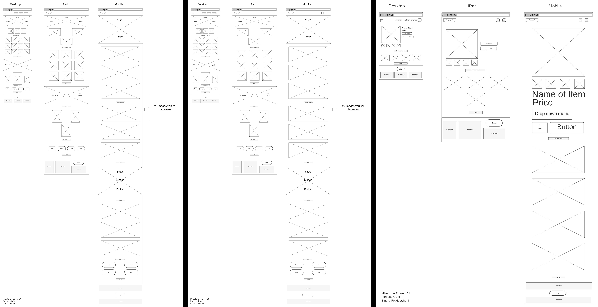
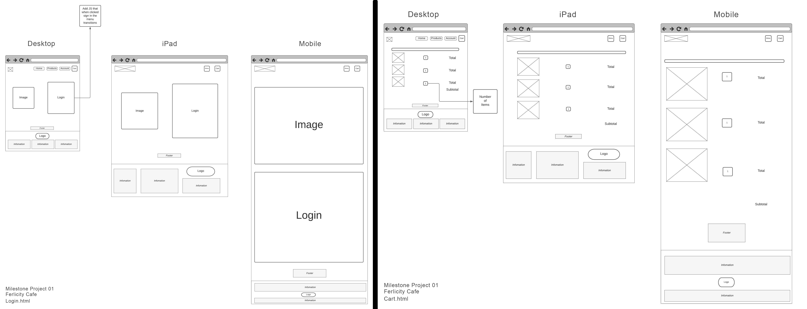
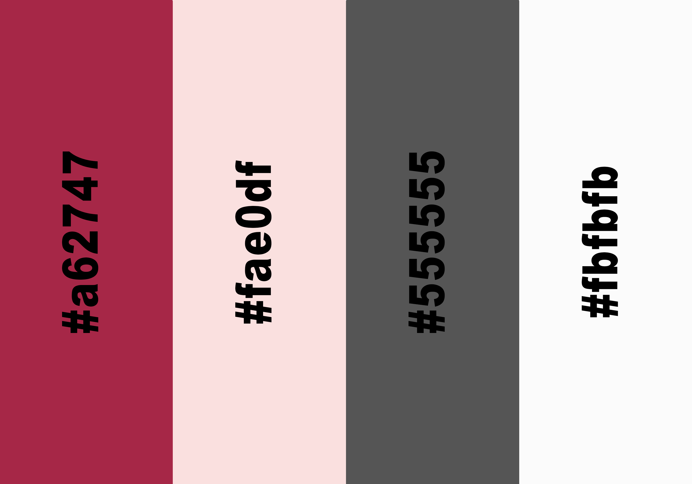
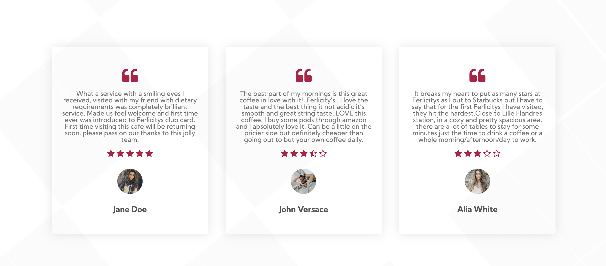
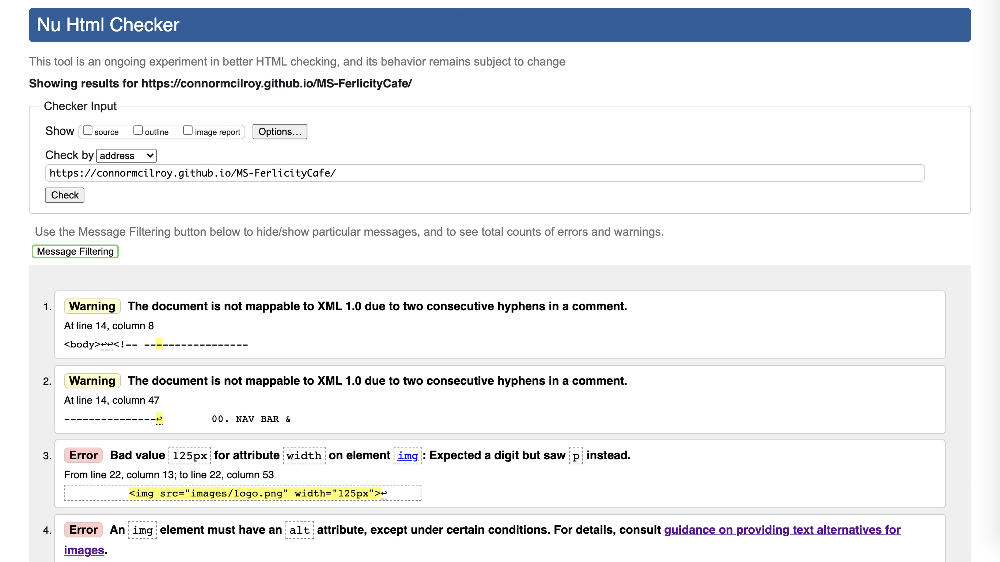
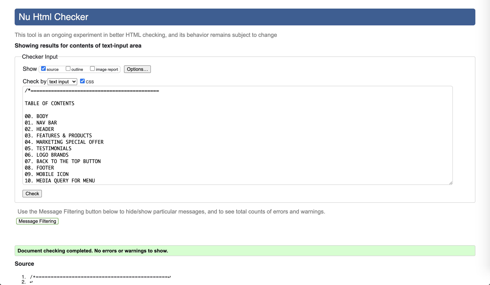

MILESTONE PROJECT 01 | FERLICITY CAFE
---------------------
- Have a look at the live website: https://github.com/ConnorMcilroy/MS-FerlicityCafe/settings/pages

Project name is a <ConnorMcilroy/MS-FerlicityCafe>
In this project, the goal is to build a static front-end site to present useful information to users, using all the technologies that you have learned about so far.
I will Incorporate a small amount of JS which I have learned from different website sources and push myself to present an understanding on how to set up a webpage.
Everything here is for educational purposes only for Code Institute.
Hand-in Date: 08/03/2021

CONTENTS OF THIS FILE
---------------------

 * Introduction
 * Wireframes
 * Getting Started
 * Refferences & Credits
 * Code
 * Uder Exsperiece
 * Acknowledgement & Conclusion
 * Contact
 * Special Thanks

INTRODUCTION
---------------------
Static front end project: Write custom HTML5 and CSS3 code to create a website of at least 3 pages, or (if using a single scrolling page), at least 3 separate page areas.
Information Architecture: Incorporate a main navigation menu and structured layout (you might want to use Bootstrap to accomplish this).

Documentation: Write a README.md file for your project that explains what the project does and the value that it provides to its users.
Version Control: Use Git & GitHub for version control.

Attribution: Maintain clear separation between code written by you and code from external sources (e.g. libraries or tutorials). Attribute any code from external sources to its source via comments above the code and (for larger dependencies) in the README.
Deployment: Deploy the final version of your code to a hosting platform such as GitHub Pages.

WIREFRAMES
---------------------

- index.HTML (https://www.flickr.com/photos/184809325@N06/51014797321/in/dateposted-public/)
- products.HTML (https://www.flickr.com/photos/184809325@N06/51014797321/in/dateposted-public/)
- singleproducts.HTML (https://www.flickr.com/photos/184809325@N06/51014886807/in/dateposted-public/)
- login.HTML (https://www.flickr.com/photos/184809325@N06/51014073608/in/dateposted-public/)
- cart.HTML (https://www.flickr.com/photos/184809325@N06/51014073663/in/dateposted-public/)

Colour Scheme
---------------------

The colour scheme used for this website was composed through the use of Coolor.

Rough Red #a62747
Beige Pink #fae0df
Gray #555555
Pale White #fbfbfb

TYPOGRAPHY
---------------------

The primary font I have chosen for my project is Kumbh Sans. The fonts were taken from Google Fonts.

IMAGERY
---------------------

The logo was created by myself through the use of Thunderstorm font purched from Graphicriver (https://graphicriver.net/).
All product images was taken from Costa website (https://www.costa.co.uk/), to represent the products of coffee. For the the other graphic images they were purchased once more from Graphicriver, then edited by myself.  

GETTING STARTED
---------------------
This will be a cafe e-commerce website design of coffee named; Ferlicity Cafe.
the content will hold 4 webpages, along with a folder which contains all requires icons, png & jpeg assets.
- images/..
- README.md
- index.HTML
- products.HTML
- singleproducts.HTML (There will be multiple of these HTML files as I will be using them for all products shown)
- cart.HTML

REFFERENCES & CREDITS
---------------------
The following are the refference and sources used:

- Google fonts (https://fonts.google.com/)
- Bootstrap (https://getbootstrap.com/)
- Font Awesome (https://fontawesome.com/)
- Responsive design (http://ami.responsivedesign.is/)
- Gstatic
- w3schools (https://www.w3schools.com/)
- Costa Product images (https://www.costa.co.uk/)
- Google Images (www.googleimages.com)
- Code Institute - BootstrappingYourNextBigIdea
- Youtube Webdev Channel - (https://www.youtube.com/channel/UCZc238wXqeN2M2uXQaY9MEw)
- Youtube Channel Easy Tutorials - (https://www.youtube.com/watch?v=vOXGuNVRGpA&t=1s)

CODE
------
- Product card used from (https://www.w3schools.com/howto/howto_css_product_card.asp)
- Coffee images were used from Costa website (https://www.costa.co.uk/)
- images of coffee and testimonials were taken from google
- Ferlicity graphics banner and logo in art were purchaced by myself & logo was created by myself.
- Featured Products & Latest Product code we're taken from (https://css-tricks.com/designing-a-product-page-layout-with-flexbox/) Then edited to fit my project.
- Testimonials code we're help via (https://www.w3schools.com/howto/howto_css_team.asp) & (https://www.youtube.com/watch?v=zkyIVFoLxgY)
- Banner & Login code was taken and used from Youtube Channel Easy Tutorials - (https://www.youtube.com/watch?v=vOXGuNVRGpA&t=1s)

FEATURED PAGES
------------------

• Home page

On the home page, the user is met with a responsive navigation bar with the website logo to the left-hand side, continue to look to the right you'll see three title links along with an icon link. It keeps it simple and visually appealing, to not over-clutter the page. Just below you'll see the banner which I worked on to make it inviting and upbeat. On the left, you'll see the slogan and a subtitle, followed by a clickable button that leads you directly to all the products. Continue to scroll down I placed three images which I place as I intended to show a type of social media for Ferlicitys Cafe. Now reaching the featured and latest products sections, there a brief selection if the products which are all clickable that'll lead the user to that product. Now reaching the marketing placements of the home page, I felt it was important to create a sense of believability to the page. I began by placing a special offer banner with all the information that would draw the user in to see what the product is. Community comments and review is something which is a staple for most cafe/restaurant websites, so I created one of my own by using three bold appealing reviews along with a hover feature when scrolled over. I wanted to add something more before reaching the banner, so I thought of product logos, something that would show what other products Ferlicity Cafe has to offer. Finally reaching the Banner, this was something that gave me a bit of bother but I concluded to keep it simple, I didn't want to go overboard and it was showing all the key information needed. To begin with, I began by placing the logo in the center and a subtitle below followed by placing information and icons to the left and right of it. On the left you'll see Apple and Android icons which are both clickable that will take you to their homepages, this is to market Ferlicitys Cafe app. To the right useful link to the webpage along with social media pages, once more these are all clickable. This brings us to the end of the Home page.

• All Products

I wanted the user to want the products to satisfy what they are looking for and so I knew it would be easy to go overboard and add everything. However, I kept it simple and in line with what I was wanting to achieve. So to begin with I began by acquiring product images off Costa website to then edit them within Photoshop to make the background of the images white as if I left them to be the would-be pale grey so naturally wouldn't look too appealing. For each product item, all have a hover over feature along with a rating of the product. Below the products there is a page button, unfortunately, they do not lead anywhere but I have added a hover over feature to demonstrate how it would look. Finally a banner. I was quite proud of this section as it pushed me to go out and look at how to build something like this but I was happy that I made a page that was simple to view and use by the user.

• Single Products

The single product was quite simple to make, once one was made it was a copy and paste repetition for the remaining products. I gain a lot of inspiration for most webpage products, so I kept the layout the same. I didn't want to deviate and do something as admittingly I was a bit stuck in how to make this properly. To begin with, you can see the products with all the required information of ordering the product, on the left, there is the product image, and connected below are four images that were taken from google to use as more advertisement for the product. I was trying to be able to create hover or once clicked the image would change but it was something that I could never figure out. On the right is all the necessary information and buttons that are needed in making an order. There is a dropdown menu for the number of items that are required along with add to cart button. Underneath the product is a row of more products, followed up by a banner.

• Login & Sign Up
This page was designed to give the user chance to sign up for offers and contact the administration with any questions. This page presents an upbeat and friendly hero image to the left. To the right is one of the items for which I used Javascript, as when clicking from login to sign up it'll swipe across. Unfortunately, the page does not lead to any other pages and the button only features a hover feature. 

• Cart

The Cart page was something that's mainly a visual demonstration of how the page will look and could work. It was one of the pages that I wanted to be able to expand on but I didn't have the understanding of how to take it further. The only current feature on the page is to be able to change the quantity of the item up or down. 

Features throughout the website
The navigation bar takes the user to the Home page, Products, Single Product, Account page and Sign in. The logo on the navigation bar also takes the user to the Home page. I have placed a 'Back to top button on each page to ensure the user doesn't have to manually scroll to the top when they reach the bottom of the page. I have used an arrow icon to fit with the look of simplistically I was wanting. The button was established through the use of Javascript I am aware it's not perfect but I have managed to get it working efficiently.

ISSUES TO OVERCOME 
-------------------------------
Starting out I had an issue with the cards keeping to an equal height on the Quotes/Reviews when changing screen size. Naturally as I progressed I thought the boxes looked too long on medium sized screens such as iPads, so I found a correction by changing col-4 to col-3 this stop the problem which I was having as now looking like this:

TECHNOLOGY USED
-------------------------------

Programming Languages:
- HTML5
- CSS3
- Javascript

Frameworks, Libraries and Programs:
- Bootstrap - is used to make the website responsive as well as form the layout and add components to the page.
- Google Fonts - is used to implement Sansita-Swashed to my style.css and Roboto for the buttons and CTA's.
- Flaticon - was used to select and edit the logo of the website.
- Photoshop - was used to create the wireframes for the project, edited images, creating mockup of the website for the README.md and created logo.
- Font Awesome - was used to apply social media icons on the webpage footer and icons for the webpage 'contact details' in the contact section.
- Hover.css - was used on my navigation bar links and social media links. This changes colour of the link when hovered over.
- Git - was used for version control. It was through the terminal Gitpod in which code was committed and pushed to GitHub.
- GitHub - was used to store the project pushed from Git.

TESTING
-------------------------------

Validation:

- W3C Markup Validation was used to validate the code in the HTML files. I tested each page separately and the CSS have passed with no errors.  However, with the HTML URL showing no errors. The required alt attribute specifies an alternate text for an image, the image cannot be displayed. I see my mistake and would require to go back and add ALT for each image throughout the webpage. Unfortunately due to the late submission, I didn't have time to go throughout the whole code to fix this mistake. Going forward I'll build my webpages with this in mind and not make this mistake again.

- W3C CSS Validation was used to validate the code in my style.css file.

I have tested the website on the following internet browsers:
- Google Chrome
- Microsoft Edge
- Safari
- Firefox

I have tested the website on the following devices:
- Moto G4
- Galaxy S5
- Pixel 2
- iPhone 6/7
- iPhone X
- ipad
- iPad Pro

Testing process:
At the beginning, I asked my partner to test my website on their device as well as ask for their opinion on any issues.
Quote: "I used it on my laptop and it worked fine. I had no issues visually and technically with it. I definetely love the colours it's very soothing in the eyes. Also it's so simple to use and user-friendly." 

Known Bugs
The scroll back to the top button behaviour: didn't work as intended as once clicked it simply cuts for that point of the webpage to the top without a smooth transition back to the top. 

ACKNOWLEDGEMENTS & CONCLUSION 
-------------------------------
I understand that I have a basic understanding and it took me more than one or two repositories to figgure out how to build a basic 
webpage, once that layout was place creating graphicsand style for the page became much smoother for me. What I need to improve upon is 
margins and spacing, as that was the one constant thing which continued to bug out. I am pround that looked at basic JS for toggle mobile menu, 
login & sign up menu. There was some other JS code I wanted to use but I lacked the knowlage in doing so but I can see how JS can be utilized into making
webpages fluid with animation that increases users exsperience. I feel JS is what Ill find myself becoming absorbed with but until then I need to continue to 
work on my HTML and CSS margins and spacings.

CONTACT
---------------------
If you want to contact me you can reach me at connor.r.white@icloud.com

SPECIAL THANKS!
---------------------
Thank you code institute for getting me this far, I am beginning to get the grip of how HTML & CSS work with a tad of JS. I 
look forward to what you'll teach me next!

