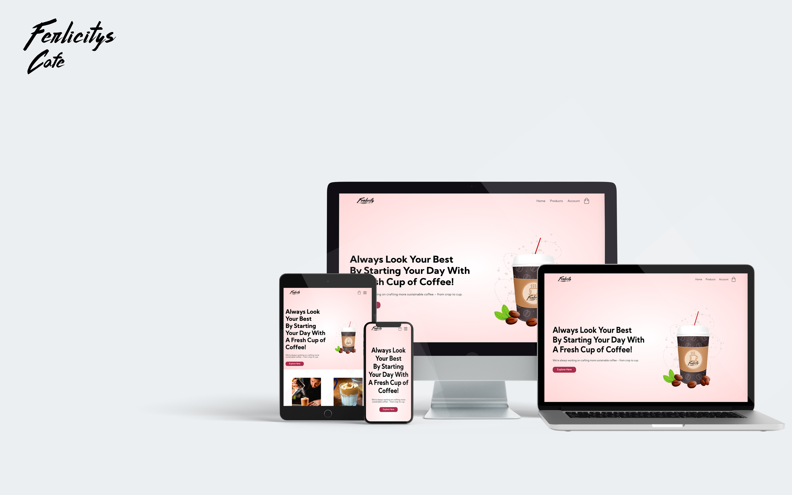

MILESTONE PROJECT 01 | FERLICITY CAFE
---------------------

Project name is a <ConnorMcilroy/MS-FerlicityCafe>
In this project, the goal is to build a static front-end site to present useful information to users, using all the technologies that you have learned about so far.
I will Incorporate a small amount of JS which I have learned from different website sources and push myself to present an understanding on how to set up a webpage.
Everything here is for educational purposes only for Code Institute.
Hand-in Date: 08/03/2021

CONTENTS OF THIS FILE
---------------------

 * Introduction
 * Wireframes
 * Getting Started
 * Refferences & Credits
 * Code
 * Uder Exsperiece
 * Acknowledgement & Conclusion
 * Contact
 * Special Thanks

INTRODUCTION
---------------------
Static front end project: Write custom HTML5 and CSS3 code to create a website of at least 3 pages, or (if using a single scrolling page), at least 3 separate page areas.
Information Architecture: Incorporate a main navigation menu and structured layout (you might want to use Bootstrap to accomplish this).

Documentation: Write a README.md file for your project that explains what the project does and the value that it provides to its users.
Version Control: Use Git & GitHub for version control.

Attribution: Maintain clear separation between code written by you and code from external sources (e.g. libraries or tutorials). Attribute any code from external sources to its source via comments above the code and (for larger dependencies) in the README.
Deployment: Deploy the final version of your code to a hosting platform such as GitHub Pages.

WIREFRAMES
---------------------
- index.HTML (https://www.flickr.com/photos/184809325@N06/51014797321/in/dateposted-public/)
- products.HTML (https://www.flickr.com/photos/184809325@N06/51014797321/in/dateposted-public/)
- singleproducts.HTML (https://www.flickr.com/photos/184809325@N06/51014886807/in/dateposted-public/)
- login.HTML (https://www.flickr.com/photos/184809325@N06/51014073608/in/dateposted-public/)
- cart.HTML (https://www.flickr.com/photos/184809325@N06/51014073663/in/dateposted-public/)

GETTING STARTED
---------------------
This will be a cafe e-commerce website design of coffee named; Ferlicity Cafe.
the content will hold 4 webpages, along with a folder which contains all requires icons, png & jpeg assets.
- images/..
- README.md
- index.HTML
- products.HTML
- singleproducts.HTML (There will be multiple of these HTML files as I will be using them for all products shown)
- cart.HTML

REFFERENCES & CREDITS
---------------------
The following are the refference and sources used:

- Google fonts (https://fonts.google.com/)
- Bootstrap (https://getbootstrap.com/)
- Font Awesome (https://fontawesome.com/)
- Responsive design (http://ami.responsivedesign.is/)
- Gstatic
- w3schools (https://www.w3schools.com/)
- Costa Product images (https://www.costa.co.uk/)
- Google Images (www.googleimages.com)
- Code Institute - BootstrappingYourNextBigIdea
- Youtube Webdev Channel - (https://www.youtube.com/channel/UCZc238wXqeN2M2uXQaY9MEw)
- Youtube Channel Easy Tutorials - (https://www.youtube.com/watch?v=vOXGuNVRGpA&t=1s)

CODE
------
- Product card used from (https://www.w3schools.com/howto/howto_css_product_card.asp)
- Coffee images were used from Costa website (https://www.costa.co.uk/)
- images of coffee and testimonials were taken from google
- Ferlicity graphics banner and logo in art were purchaced by myself & logo was created by myself.
- Featured Products & Latest Product code we're taken from (https://css-tricks.com/designing-a-product-page-layout-with-flexbox/) Then edited to fit my project.
- Testimonials code we're help via (https://www.w3schools.com/howto/howto_css_team.asp) & (https://www.youtube.com/watch?v=zkyIVFoLxgY)
- Banner & Login code was taken and used from Youtube Channel Easy Tutorials - (https://www.youtube.com/watch?v=vOXGuNVRGpA&t=1s)

USER EXSPERIENCE
------------------
Begin able to give the user an enjoyable exsperience is key, as if you have designed it well and have marketing your product well you'll be able to keep the user 
browsing for a much larger period of time. Even though these are simple 4 HTML & CSS web pages there is a clear layout for the user to navigate throughout the pages along with
being able to exsperiece selective CSS effect and JS effects. The choice to not over do the effect on everything was chosen purposly as it can become too much and create a silly 
stmosphere in the page. Graphic Design is my strong suit and I really wanted Ferlicity Cafe to be a bright warm design suitable to view on any device.

ACKNOWLEDGEMENTS & CONCLUSION 
-------------------------------
I understand that I have a basic understanding and it took me more than one or two repositories to figgure out how to build a basic 
webpage, once that layout was place creating graphicsand style for the page became much smoother for me. What I need to improve upon is 
margins and spacing, as that was the one constant thing which continued to bug out. I am pround that looked at basic JS for toggle mobile menu, 
login & sign up menu. There was some other JS code I wanted to use but I lacked the knowlage in doing so but I can see how JS can be utilized into making
webpages fluid with animation that increases users exsperience. I feel JS is what Ill find myself becoming absorbed with but until then I need to continue to 
work on my HTML and CSS margins and spacings.

CONTACT
---------------------
If you want to contact me you can reach me at connor.r.white@icloud.com

SPECIAL THANKS!
---------------------
Thank you code institute for getting me this far, I am beginning to get the grip of how HTML & CSS work with a tad of JS. I 
look forward to what you'll teach me next!

